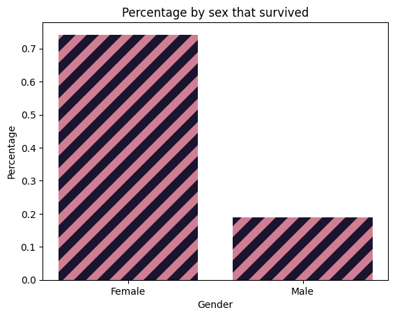
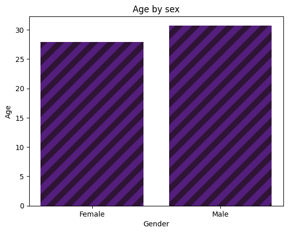
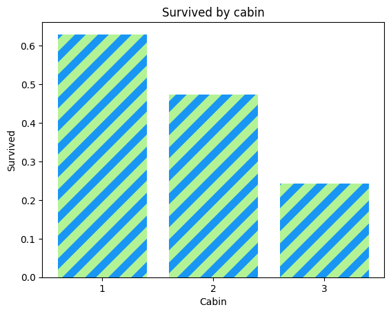

# What happened on the Titianic?

## What is the the Titanic?
The Titanic was a British passenger ship, operated by the White Star Line, that sank in the North Atlantic Ocean on 15 April 1912 after striking an iceberg during a voyage from Southampton, England, to New York City, United States.

## The Data
The data shows key components when looking at the titanic crash. For example:
| PassengerId | Survived | Pclass | Name                    | Sex  | Age | SibSp | Parch | Ticket | Fare    | Cabin | Embarked |
|-------------|----------|--------|-------------------------|------|-----|-------|-------|--------|---------|-------|----------|
| 7           | 0        | 1      | McCarthy, Mr. Timothy J | Male | 54  | 0     | 0     | 17463  | 51.8625 | E46   | S        |
## Questions
As I looked at the data I developed 3 questions:

1. What is the percentage of females to males survived the Titanic crash?

2. What was the average age of women and men on the Titanic?

3. What is the percentage of people by passenger class that survived the Titanic crash?

## What is the percentage of females to males survived the Titanic crash?

The graph clearly shows a correlation between the males and females that survived the fateful titanic crash. Since women and children were top priority I can definitely see why the graph shows this data.

## What was the average age of women and men on the Titanic?

The data presented in the graph reveals that the older passengers were male and the younger passengers were female.

## What is the percentage of people by passenger class that survived the Titanic crash?

It is interesting to note the difference in values between the passenger class as the higher the class was there was more survivors, and the lower the class the less survivors there were. Which makes sense as the higher class the higher you are from the bottom ehcih means the higher you are the more time it would take get to safety.

## Conclusion

While the Titanic was a horrific event, it holds many questions that can be answered by viewing the data. How I viewed this data and came up with my observations can be viewed by look st https://github.com/Djames16/Unit-2-Data-Science/blob/main/Titanic.ipynb.